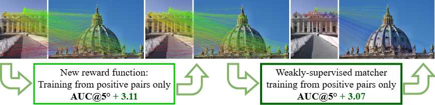

#
<p align="center">
  <h1 align="center"> <ins>RIPE++</ins>:<br> Reinforced Keypoint Learning from
Positive Pairs Only <br><br>🌊 LIMIT@ECCV 2026 in Malmö, Sweden 🌊</h1>
  <p align="center">
    <a href="https://scholar.google.com/citations?user=ybMR38kAAAAJ">Johannes Künzel</a>
    ·
    <a href="https://scholar.google.com/citations?user=BCElyCkAAAAJ">Peter Eisert</a>
    ·
    <a href="https://scholar.google.com/citations?user=5yTuyGIAAAAJ">Anna Hilsmann</a>
  </p>
  <h2 align="center"><p>
    <a href="???" align="center">Arxiv</a> | 
    <a href="???" align="center">Project Page</a> |
    <a href="???" align="center">🤗Demo🤗</a>
  </p></h2>  
  <div align="center"></div>
</p>
<br/>
<p align="center">
    
    <br>
    <em>RIPE, minus the negatives, plus a trainable matcher - full sparse matching pipelines learned from positive image pairs alone.</em>
</p>

## Setup

💡**Alternative**💡 Install nothing locally and try our Hugging Face demo: [🤗Demo🤗](https://huggingface.co/spaces/RIPE/RIPE)

1. Clone the repo.
```bash
git clone https://github.com/fraunhoferhhi/RIPEpp.git
cd RIPEpp
```

2. Install [uv](https://docs.astral.sh/uv/getting-started/installation/)

3. Build .venv environment with:
```bash
uv sync
```

## How to use

Run [demo.py](demo.py) with:

```bash
uv run demo.py # uses default checkpoint trained on MegaDepth
uv run demo.py --scared # uses checkpoint trained on SCARED (see Sec. 4.2)
uv run demo.py --aachen # uses checkpoint trained on combination of MegaDepth and Tokyo 24/7 (see Sec. 10 of the Suppl.)
```

## Reproduce the results

### MegaDepth 1500 & HPatches

1. Clone our [Glue Factory Fork](https://github.com/JohannesK14/glue-factory)
```bash
git clone https://github.com/JohannesK14/glue-factory
```

2. Run the evaluation
```bash
cd glue-factory

uv sync
uv run python -m gluefactory.eval.megadepth1500 --conf ripepp+NN
uv run python -m gluefactory.eval.hpatches --conf ripepp+NN
```

### SCARED 1500

1. Clone our [Glue Factory Fork](https://github.com/JohannesK14/glue-factory)
```bash
git clone https://github.com/JohannesK14/glue-factory
```
2. Follow the instructions to recreate SCARED1500
3. Run:
```bash
uv run python -m gluefactory.eval.scared1500 --conf ripepp+NN model.extractor.variant=scared
```

### Aachen Day-Night v2

TBD


## Training

1. Create a .env file with the following content:
```bash
WANDB_DIR="/path/to/output/dir"
DATA_DIR="/path/to/data/dir"
SLURM_JOB_ID="DESKTOP"
```

2. Download the required datasets:
        
    <details>
    <summary>DISK Megadepth subset</summary>

    To download the dataset used by [DISK](https://github.com/cvlab-epfl/disk) execute the following commands:

    ```bash
    cd data
    bash scripts/download_disk_data.sh
    ```

    </details>

    <details>
    <summary>SCARED</summary>

    - ⚠️**Optional**⚠️: Only if you are interest in the model used in Section 4.2 of the paper!
    - Official Website of [SCARED](https://endovissub2019-scared.grand-challenge.org/About)
    - write to max.allan@intusurg.com to get access
    - execute `data/scripts/data_prep.sh` and `data/scripts/extract_videos.sh`

    ```bash
    ├── test
    │   ├── dataset_8
    │   │   ├── keyframe_0
    │   │   │   └── data
    │   │   │       ├── frame_data
    │   │   │       ├── rgb_frames_left
    │   │   │       ├── rgb_frames_right
    │   │   │       └── scene_points
    │   │   ├── keyframe_1
    │   │   │   └── data
    │   │   │       ├── frame_data
    │   │   │       ├── rgb_frames_left
    │   │   │       ├── rgb_frames_right
    │   │   │       └── scene_points
    │   │   ...
    │   ├── dataset_9
    ├── train
    │   ├── dataset_1
    │   ├── dataset_2
    │   ├── dataset_3
    │   ├── dataset_4
    │   ├── dataset_5
    │   ├── dataset_6
    ├── val
    │   ├── dataset_7
    ```

    </details>

    <details>
    <summary>Tokyo 24/7</summary>

    - ⚠️**Optional**⚠️: Only if you are interest in the model used in Section 10 of the paper!
    - Download the Tokyo 24/7 query images from here: [Tokyo 24/7 Query Images V3](http://www.ok.ctrl.titech.ac.jp/~torii/project/247/download/247query_v3.zip) from the official [website](http://www.ok.ctrl.titech.ac.jp/~torii/project/247/_).
    - extract them into data/Tokyo_Query_V3

    ```bash
    Tokyo_Query_V3/
    ├── 00001.csv
    ├── 00001.jpg
    ├── 00002.csv
    ├── 00002.jpg
    ├── ...
    ├── 01125.csv
    ├── 01125.jpg
    ├── Readme.txt
    └── Readme.txt~
    ```

    </details>


3. Run the training script:

```bash
# default
python ripepp/train.py --config-name train_default project_name=train name=reproduce wandb_mode=offline

# scared
python ripepp/train.py --config-name train_scared project_name=train name=reproduce wandb_mode=offline

# megadepth + tokyo
python ripepp/train.py --config-name train_megadepth+tokyo project_name=train name=reproduce wandb_mode=offline
```

## Acknowledgements

Our code is partly based on the following repositories:
- [DALF](https://github.com/verlab/DALF_CVPR_2023) Apache License 2.0
- [DeDoDe](https://github.com/Parskatt/DeDoDe) MIT License
- [DISK](https://github.com/cvlab-epfl/disk) Apache License 2.0

Our evaluation was based on the following repositories:
- [Glue Factory](https://github.com/cvg/glue-factory)
- [hloc](https://github.com/cvg/Hierarchical-Localization)

We would like to thank the authors of these repositories for their great work and for making their code available.

Our project webpage is based on the [Acadamic Project Page Template](https://github.com/eliahuhorwitz/Academic-project-page-template) by Eliahu Horwitz.

## BibTex Citation

TBD